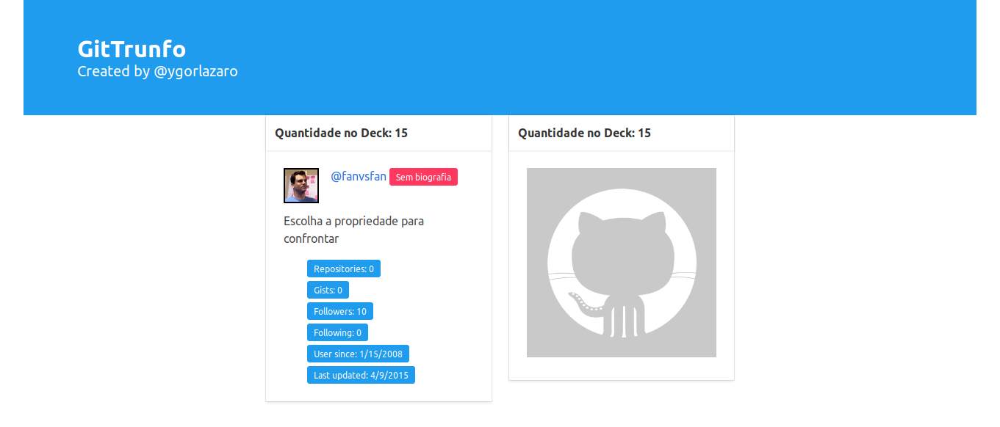

# GitTrunfo [](https://app.netlify.com/sites/gittrunfo/deploys)

[Link para acessar](https://gittrunfo.netlify.com/)



Simples joguinho de SuperTrunfo usando a API de usuários do GitHub.

# Para rodar:

``` bash
# instala dependências
npm install

# servidor com hot reload rodando em localhost:8080
npm run dev
```

## Scripts completos

``` bash
# instala dependências
npm install

# servidor com hot reload rodando em localhost:8080
npm run dev

# build para produção
npm run build

# build para produção com bundle report
npm run build --report
```
